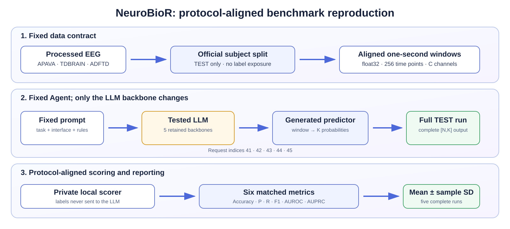

# NeuroBioR Reproducibility Package

This repository contains the code, fixed prompts, retained model-generated predictors,
probability matrices, analysis outputs, and paper tables for the NeuroBioR benchmark.
The benchmark evaluates a **fixed Agent pipeline with different LLM backbones** on
Medformer-aligned EEG classification tasks. The Agent, data contract, split,
preprocessing, output schema, scorer, and metrics remain fixed; only the LLM backbone
changes.



## What is evaluated

| Dataset | Clinical task | Official TEST windows | Input shape | Classes |
|---|---|---:|---|---|
| APAVA | source-cohort HC vs AD classification | 1,431 | `[N,256,16]` | 2 |
| TDBRAIN | source-cohort HC vs PD classification | 960 | `[N,256,33]` | 2 |
| ADFTD | source-cohort HC vs FTD vs AD classification | 14,648 | `[N,256,19]` | 3 |

Every input row is a one-second, 256 Hz EEG window. The public input tensors contain
no labels or source subject identifiers. Scoring uses Accuracy, macro Precision,
macro Recall, macro F1, one-vs-rest macro AUROC, and one-vs-rest macro AUPRC.

## Fixed experimental protocol

1. Use the subject-independent TEST split from the pinned Medformer data pipeline.
2. Apply the same per-window, per-channel standardization used by the benchmark pack.
3. Give the tested LLM the fixed task prompt and interface contract.
4. The fixed Agent asks the LLM to synthesize `predict(window) -> K probabilities`.
5. The generated deterministic predictor is checked before execution.
6. Run the predictor over every TEST window and score the complete `[N,K]` matrix.
7. Repeat synthesis with request indices 41--45; report mean and sample standard deviation.

The LLM-based method is zero-shot with respect to these benchmark labels: it receives
no TRAIN, VALID, or TEST labels and is not fine-tuned on the three benchmark datasets.
The supervised reference models follow their own published training protocol.

## Repository map

| Path | Purpose |
|---|---|
| `prompts/` | Fixed task prompts for the three datasets |
| `results/selected_75_runs/` | 5 backbones × 3 datasets × 5 retained runs |
| `results/tables/` | Per-run metrics, mean ± sample SD, and submission tables |
| `analysis/adftd_failure_mode/` | ADFTD confusion and decision-collapse analysis |
| `src/neurobior_repro/` | Minimal loader, scorer, and predictor replay code |
| `scripts/` | Validation, re-scoring, and predictor replay entry points |
| `third_party/Medformer/` | Pinned upstream Medformer code snapshot and license |
| `docs/` | English and Chinese step-by-step instructions |

## Quick start

```bash
python -m venv .venv
source .venv/bin/activate            # Windows PowerShell: .venv\Scripts\Activate.ps1
python -m pip install --upgrade pip
python -m pip install -e ".[test]"
python -m pytest -q
```

Download the companion data archive from the release location recorded in
`DOWNLOADS.md`, extract it beside this repository, and run:

```bash
python scripts/validate_release.py \
  --data-root ../NeuroBioR_Aligned_TEST_Data_v1.1/data
```

For the complete command sequence, see [REPRODUCE.md](REPRODUCE.md). A Chinese guide
is available at [docs/REPRODUCTION_GUIDE_CN.md](docs/REPRODUCTION_GUIDE_CN.md).

## Scope of the companion data archive

The archive contains complete aligned TEST packs for APAVA and ADFTD. TDBRAIN is
access-controlled and therefore is not redistributed. Its retained predictors,
probability matrices, scores, and paper-table rows are included here; an independently
obtained authorized TDBRAIN copy is required for signal-level replay. See
`docs/DATA_ACCESS.md` for the exact boundary.

## Main retained model rows

The release contains complete 5-run rows for GPT-4.1-mini, GPT-4o,
Qwen3-235B-A22B Thinking 2507, Gemini 3 Flash Thinking, and GLM-5 on all three tasks.
Exact values are in `results/tables/*_submission_table.csv` and
`results/tables/agent_llm_mean_sample_sd.csv`.

## License and citation

The included Medformer snapshot remains under its upstream MIT License. Dataset use
is governed by each dataset owner. See `LICENSES_AND_DATA_TERMS.md` before redistribution.
Citation metadata is provided in `CITATION.cff`.

